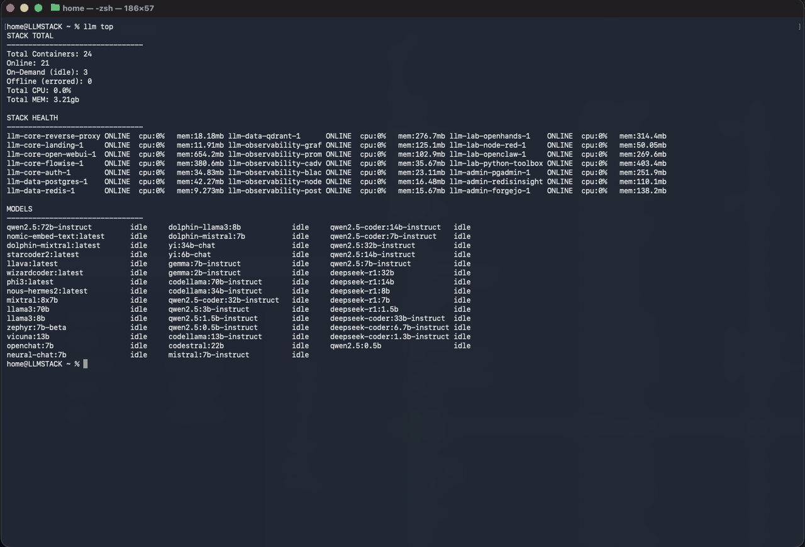

# LLMStack



LLMStack is a self-hosted local LLM stack built around Docker Compose. It provides a modular setup for running models, a web UI, vector search, RAG ingestion, and optional agent tooling.

## Layered stacks (Docker Desktop groups)

The stack now runs as multiple compose projects so Docker Desktop shows clean grouped stacks:

- `llm-data`
- `llm-core`
- `llm-observability`
- `llm-admin`
- `llm-lab`

Primary scripts:

- `./tools/scripts/up/core.sh`
- `./tools/scripts/up/observability.sh`
- `./tools/scripts/up/admin.sh`
- `./tools/scripts/up/lab.sh`
- `./tools/scripts/up/full.sh`
- `./tools/scripts/down/all.sh`
- `./tools/scripts/status/show.sh`

Compatibility wrappers remain:

- `./tools/bin/cli-handler/llm up full` (defaults to full)
- `./tools/bin/cli-handler/llm down all`
- `./tools/bin/cli-handler/llm status`

See:

- `docs/architecture.md`
- `docs/service-map.md`
- `docs/stack-modes.md`

## Recent updates

- Forgejo is now routed through the reverse proxy at `https://forgejo.llmstack.lan/`.
- Authelia is configured as the SSO gateway for the stack so you don't have to manage separate passwords per app.
- Flowise supports PDF drop-in via bind mount: `./data/pdfs` -> `/data/pdfs`.
- DefectDojo is available at `https://defectdojo.llmstack.lan/` as the repo scanner GUI, with Dockerized gitleaks imports via `./tools/bin/security/defectdojo-gitleaks-scan`.
- Stirling-PDF is available at `https://pdf.llmstack.lan/` for manual PDF changes, with the internal API reachable at `http://stirling-pdf:8080` for code-driven PDF operations.
- Added `pdf-auto-ingest` watcher service to auto-upsert dropped PDFs through Flowise (lab profile).
- Rebuilt Flowise PDF ingestion and retrieval chatflows with current node wiring for latest Flowise compatibility.
- OpenWebUI API proxy auth handling was adjusted to prevent chat timeout/500 issues.

## What is included

- Ollama for running local models.
- Open WebUI for a browser-based chat interface.
- Qdrant for vector search.
- Postgres and Redis as optional supporting services.
- Flowise for visual agent graphs.
- OpenHands for an agentic coding workspace.
- PDF ingestion and a simple RAG pipeline for indexing documents.
- Local speech-to-text, text-to-speech, and OCR utilities.
- Authelia authentication gateway for protected web access.

## Service layers

Use this as a quick reference for what each service does, grouped by operational layer.

### 1) Core runtime layer

This is the stuff that makes AI actually run.

| Service | Purpose | Typical need |
|---|---|---|
| `open-webui` | Main chat interface and user-facing AI workspace. | Core |
| `ollama` | Local model inference backend. | Core |
| `postgres` | Structured app state and relational data storage. | Core |
| `qdrant` | Vector index and similarity retrieval for RAG. | Core for RAG |

### 2) Platform services layer

This is the stuff that supports the runtime.

| Service | Purpose | Typical need |
|---|---|---|
| `reverse-proxy` | Single web entrypoint on 80/443 and routing for all UIs. | Core |
| `auth` (Authelia) | Login and access control in front of protected routes. | Core |
| `redis` | Cache/queue support for supporting services and workflows. | Core |
| `python-toolbox` | FastAPI endpoints + toolbox scripts for stack automation jobs. | Lab profile |
| `python-toolbox` | Script runtime container for maintenance/one-off jobs. | Lab profile |
| `landing` | Landing page and navigation for stack services. | Core |
| `forgejo` | Self-hosted Git service for local repos/collaboration. | Admin profile |

### 3) Observability layer

This is how you inspect and understand the system.

| Service | Purpose | Typical need |
|---|---|---|
| `prometheus` | Metrics scraping and storage. | Observability profile |
| `grafana` | Metrics dashboards and alert visualization. | Observability profile |
| `pgadmin` | Postgres inspection and query administration. | Admin profile |
| `redisinsight` | Redis inspection and operational troubleshooting. | Admin profile |

### 4) Automation and tooling layer

This is where the stack starts doing useful work beyond just chatting.

| Service | Purpose | Typical need |
|---|---|---|
| `flowise` | Visual workflow/agent builder and API flows. | Lab profile |
| `node-red` | Low-code automation and orchestration. | Lab profile |
| `pdf-auto-ingest` | Watches PDF folder and auto-upserts to Flowise/RAG. | Lab profile |

### 5) Experimental layer

This is the stuff you are testing, learning, or may remove later.

| Service | Purpose | Typical need |
|---|---|---|
| `openclaw` | Agent gateway/runtime UI for advanced local workflows. | Lab profile |
| `openhands` | Agentic coding workspace service. | Lab profile |

Job-style services are run on demand rather than left up all the time (RAG pipeline, PDF ingest jobs, STT, TTS, OCR).

## Quick start

1) Copy the macOS environment example.

```bash
cp .env.mac.example .env.mac
cp config/auth/users_database.example.yml config/auth/users_database.yml
```

2) Start the core stack (default).

```bash
./tools/bin/cli-handler/llm up full
```

Enable optional groups only when needed:

```bash
./tools/bin/cli-handler/llm up observability
./tools/bin/cli-handler/llm up observability-host
./tools/bin/cli-handler/llm up admin
./tools/bin/cli-handler/llm up lab
```

See `docs/25-service-profiles.md` for architecture, overlap audit, and mode commands.

On macOS, `./tools/bin/cli-handler/llm up full` also starts host (bare-metal) Ollama when installed locally,
and `./tools/bin/cli-handler/llm down all` stops it. Set `LLMSTACK_MANAGE_HOST_OLLAMA=0` to disable this behavior.

Cutover day runbook:

- `MAC-CUTOVER-CHECKLIST.md`

3) Open the UI via the reverse proxy.

Add these entries to your hosts file first:

```
127.0.0.1  llmstack.lan
127.0.0.1  openwebui.llmstack.lan
127.0.0.1  flowise.llmstack.lan
127.0.0.1  openhands.llmstack.lan
127.0.0.1  openclaw.llmstack.lan
127.0.0.1  grafana.llmstack.lan
127.0.0.1  nodered.llmstack.lan
127.0.0.1  forgejo.llmstack.lan
127.0.0.1  prometheus.llmstack.lan
127.0.0.1  pgadmin.llmstack.lan
127.0.0.1  redisinsight.llmstack.lan
127.0.0.1  qdrant.llmstack.lan
```

Generate this block automatically:

```bash
./tools/bin/create-host-entries/llm-hosts-update --print
```

macOS hosts file path: `/etc/hosts`

```bash
sudo nano /etc/hosts
```

After saving on macOS, flush DNS cache:

```bash
sudo dscacheutil -flushcache
sudo killall -HUP mDNSResponder
```

Then open:

- Landing page: https://llmstack.lan/
- Authelia login: https://llmstack.lan/authelia/
- Open WebUI: https://openwebui.llmstack.lan/
- Flowise: https://flowise.llmstack.lan/
- OpenHands: https://openhands.llmstack.lan/
- OpenClaw: https://openclaw.llmstack.lan/
- DefectDojo: https://defectdojo.llmstack.lan/
- Stirling-PDF: https://pdf.llmstack.lan/
- Grafana: https://grafana.llmstack.lan/
- Node-RED: https://nodered.llmstack.lan/
- Forgejo: https://forgejo.llmstack.lan/
- Prometheus: https://prometheus.llmstack.lan/
- pgAdmin: https://pgadmin.llmstack.lan/
- RedisInsight: https://redisinsight.llmstack.lan/
- Qdrant dashboard: https://qdrant.llmstack.lan/dashboard

You will be prompted to log in via Authelia. The first visit to each subdomain will
also show a browser TLS warning because a self-signed cert is used for local HTTPS.

## Access and ports

All web access goes through the reverse proxy on ports 80/443. Use the URLs above to
reach each service after logging in. Internal services and databases are not exposed
on host ports by default.

The following components are job-style services, not web UIs:

- RAG pipeline: run on demand to index content.
- PDF ingestion: run on demand to convert PDFs to markdown.
- Flowise PDF auto-ingest: optional watcher for PDFs dropped into a bind-mounted host folder.
- Python toolbox: run one-off scripts and maintenance tasks.
- STT, TTS, OCR: run on demand using the helper scripts.

The landing page at https://llmstack.lan/ provides links to the protected UIs after
you authenticate. Authelia only handles login and redirects; it does not provide a
service menu.

## Python toolbox

The python-toolbox container is a CLI-first environment for running scripts under
`python-toolbox/app` and also serves the FastAPI surface on port 8000 for Node-RED
or Flowise triggers.

Build the image:

```bash
docker compose --env-file .env.mac -p llm-lab -f compose/lab.yml build python-toolbox
```

Start the toolbox container and exec into it:

```bash
docker compose --env-file .env.mac -p llm-lab -f compose/lab.yml up -d python-toolbox
docker compose --env-file .env.mac -p llm-lab -f compose/lab.yml exec python-toolbox bash
```

Start the API surface (same `python-toolbox` service):

```bash
docker compose --env-file .env.mac -p llm-lab -f compose/lab.yml up -d python-toolbox
```

Example script runs:

```bash
python /app/scripts/plc_poll/poll_plc.py
python /app/scripts/rag_ingest/ingest_folder.py
python /app/scripts/db_tools/healthcheck.py
```

See `services/python-toolbox/README.md` for environment variables and usage notes.

### Ports you may need to change

These services publish host ports for local access. Change the host side of the
mapping if the port is already in use.

- Reverse proxy: `80` and `443` for all web UIs via the gateway.
- Forgejo web UI: `https://forgejo.llmstack.lan/` through reverse proxy (container still listens on `3000`).
- Forgejo SSH: `2222` for git over SSH.

By default the published ports bind to `127.0.0.1`. Set `HOST_BIND_IP=0.0.0.0`
only if you intentionally want LAN exposure.

### Persistent data and reset behavior

Named volumes store service data across restarts. Removing a volume deletes that
service data. Bind mounts under `data/` are local folders and can be cleaned
by deleting their contents.

- Named volumes include `ollama_data`, `openwebui_data`, `qdrant_data`,
  `postgres_data`, `redis_data`, `flowise_data`, `openhands_data`, `prometheus_data`,
  `grafana_data`, and `forgejo_data`.
- `docker compose down` keeps named volumes.
- `docker compose down -v` removes named volumes, which wipes stored data.
- The OpenHands repo bind mount is `./data/openhands-workspace` and is safe to clean when you want a fresh workspace.
- Flowise PDF drop folder uses a local bind mount: `./data/pdfs` -> `/data/pdfs`.

If you run Ollama on bare metal, keep port `11434` available on the host and set
`OLLAMA_UPSTREAM_URL=http://host.docker.internal:11434` in your env file. Containers
should point `OLLAMA_BASE_URL` at the internal `ollama-gateway` service instead of
talking to the host directly. The Ollama container does not publish a host port by
default. If you need to expose the container port, add a ports mapping in
`compose/lab/ollama/docker-compose.yml`.

The stack now routes Ollama traffic through a dedicated `llm-ollama-access` network.
Only services that actually need model access join that network, and only the
`ollama-gateway` service knows the host-reachable upstream URL.

The intended Ollama clients are:

- `open-webui`
- `flowise`
- `python-toolbox`
- `rag-pipeline`

The gateway only proxies inference and metadata endpoints used by stack services.
It does not expose general model-management routes such as pull, push, create, or
delete through the Docker network.

Native Ollama remains a trusted internal backend for stack services. Authelia
protects browser-facing routes, but it is not an auth gateway for the Ollama API
used by Open WebUI, Flowise, the RAG pipeline, or other internal components.

If you want to harden native Ollama further on macOS, the repo includes scoped
`pf` helpers that block non-loopback TCP access to `11434` while keeping
`127.0.0.1` working for local host processes:

```bash
./tools/bin/cli-handler/llm ollama-firewall-enable
./tools/bin/cli-handler/llm ollama-firewall-status
./tools/bin/cli-handler/llm ollama-firewall-disable
```

If host Ollama should use model storage on external media, set it explicitly with:

```bash
./tools/bin/cli-handler/llm ollama-models-path /Volumes/LLM_DATA/ollama/models
```

That updates the macOS `launchctl` environment for the Homebrew Ollama service,
restarts the service, and keeps the stack pointed at the drive-backed model store.

## Local Git

This stack includes a Forgejo service for local git hosting. Forgejo is a
lightweight, self-contained server that works well in homelab and air-gapped setups.

- Web UI: https://forgejo.llmstack.lan/
- SSH: port 2222

If these ports are in use, update the port mappings in
`compose/admin/forgejo/docker-compose.yml`.

`./tools/bin/cli-handler/llm up full` starts Forgejo with the rest of the stack. To start only admin services (including Forgejo):

```bash
./tools/bin/cli-handler/llm up admin
```

## Security Scanning

DefectDojo runs in the admin layer at `https://defectdojo.llmstack.lan/`.

Run a Dockerized gitleaks scan and import the redacted report into the DefectDojo GUI:

```bash
./tools/bin/security/defectdojo-gitleaks-scan
```

If your SSO user can log in but cannot see the `LLMStackMac` product yet, log in once and then grant product access:

```bash
./tools/bin/security/defectdojo-grant-product-access your-username
```

You can also set `DEFECTDOJO_PRODUCT_MEMBERS` in your local `.env.mac` so future scans keep those users attached to the product automatically.

By default the gitleaks import closes old findings that disappear from later scans, so DefectDojo stays aligned with the current repo state instead of accumulating stale false positives.

See `docs/git-local.md` for setup and backup details.

## OpenHands Workspace

The workspace container provides a safe play area for OpenHands and CLI tools. It
mounts `./data/openhands-workspace` to `/workspace` and runs as a non-root user.

```bash
./tools/bin/cli-handler/llm up lab
```

See `docs/workspace-container.md` for guardrails and reset guidance.

## Workspace convention

PDF ingestion uses a single canonical host path:

- `data/pdfs/` for incoming PDFs
- `data/pdfs/processed/original/` for source files moved after successful processing
- `data/pdfs/processed/rawtext/` for extracted markdown used by RAG
- `data/pdfs/processed/json/` for per-file metadata
- `data/pdfs/processed/chunk/` for chunk artifacts
- `data/pdfs/failed/` for failed Flowise upserts

This keeps PDF ingest and indexing state consolidated under `data/`.

Create the PDF folders when needed:

```bash
mkdir -p data/pdfs/ingest-dropzone data/pdfs/processed/{original,rawtext,json,chunk} data/pdfs/failed
```

## Common tasks

Live logs for real debugging:

```bash
SINCE=2h ./tools/bin/cli-handler/llm logs reverse-proxy auth open-webui flowise
```

Incident bundle (snapshot everything useful):

```bash
./tools/bin/cli-handler/llm debug-bundle
```

Run PDF ingestion:

```bash
docker compose --env-file .env.mac -p llm-lab -f compose/lab.yml run --rm pdf-ingest
```

Run the RAG pipeline (Ollama + Qdrant + ingestion job):

```bash
./tools/bin/cli-handler/llm up core
./tools/bin/cli-handler/llm up full data
docker compose --env-file .env.mac -p llm-lab -f compose/lab.yml run --rm rag-pipeline
```

Run a Python one-off job:

```bash
docker compose --env-file .env.mac -p llm-lab -f compose/lab.yml run --rm python-toolbox python /app/scripts/db_tools/healthcheck.py
```

Start only Flowise:

```bash
./tools/bin/cli-handler/llm up core
```

Configure Flowise auto-ingest watcher in `.env.mac`:

```env
FLOWISE_URL=http://flowise:3000
FLOWISE_INGEST_CHATFLOW_ID=<your_ingestion_chatflow_id>
FLOWISE_INGEST_STOP_NODE_ID=qdrant_0
```

When configured, PDFs dropped into `./data/pdfs` are picked up automatically,
sent to Flowise vector upsert, and logged to stdout by `pdf-auto-ingest`.

If Flowise opens a blank screen after updates, hard refresh (`Ctrl+F5`) or open
Flowise in an incognito window once to clear stale frontend state.

Install the standard Ollama model set:

```bash
./tools/bin/cli-handler/llm models pull
```

Run a speech-to-text example:

```bash
./tools/bin/stt-transcribe sample.wav
```

Place `sample.wav` in `data/audio/in/` before running the command.

## Documentation

See the docs for details:

- `docs/10-install.md`
- `docs/cli.md`
- `docs/30-rag.md`
- `docs/pdf-ingestion-flow.md`
- `docs/40-agents.md`
- `docs/50-media.md`
- `docs/60-auth.md`
- `docs/70-nodered.md`
- `docs/git-local.md`
- `docs/workspace-container.md`
- `docs/runbooks/bringup.md`

### Normal chat (no RAG)

```
[Browser]
   |
   v
[Reverse Proxy] ---> [Auth Gateway]
   |                    |
   |<---- session -------|
   v
(trigger: user types message)
        ↓
[Reverse Proxy + Auth Gateway]
(always-on)
        ↓
[Open WebUI]
   |
   v
[Ollama]  (LLM inference)
(always-on UI)
        ↓
[Ollama]
(always-on LLM inference)
        ↓
[Open WebUI]
(response rendered)
        ↓
[Browser]
```

### Ask questions over your docs (RAG query-time)

```
[Browser]
   |
   v
[Reverse Proxy] ---> [Auth Gateway]
   |
   v
[Flowise UI / Flowise API]  (reasoning graph)
   |
   | 1) retrieve context
   v
[Qdrant]  (vectors + payload)
   |
   | 2) generate answer with context
   v
[Ollama]  (LLM)
   |
   v
[Flowise returns answer]
   |
   v
(trigger: user asks question)
        ↓
[Reverse Proxy + Auth Gateway]
(always-on)
        ↓
[Flowise UI / API]
(always-on reasoning graph)
        ↓ retrieve context
[Qdrant]
(always-on vector store)
        ↓ context + question
[Ollama]
(always-on LLM)
        ↓ answer
[Flowise]
(reasoning output)
        ↓
[Browser]
```

### Drop a PDF, automatically OCR it, index it, then it’s searchable (RAG ingestion)

```
[You drop PDF]
into data/pdfs/
      |
      | OCR
      v
[OCR Service]  (text extraction)
      |
      | write markdown
      v
data/pdfs/processed/rawtext/
      |
      | chunk + embed
      v
[RAG Pipeline]
      |
      | optional metadata
      v
[Postgres]  (doc index status, logs, etc.)
```

### Voice note → transcript → (optional) answer → spoken reply

```
[Audio file]
data/audio/in/
      |
      | STT
      v
[STT Service]  -------------> data/audio/out/transcript.txt
      |
      | optional RAG query
      v
[Flowise]
      |
      | TTS
      v
[TTS Service] -----------------> data/audio/out/reply.wav
```

### If something breaks, tell me (alerts + dashboards)

```
[All services/jobs emit metrics]
        |
        v
   [Prometheus]  (scrapes /metrics)
        |
        v
    [Grafana]  (dashboards)
        ^
        |
[Node-RED] (job status + alerts)
        |
        +----> [Discord webhook]  (notify)
```

```
[Job success / failure]
(trigger: event)
        ↓
[Node-RED]
(always-on)
        ↓
[Discord / Webhook]
(notification)
        ↓
[Prometheus]
(metrics)
        ↓+----> [Discord webhook]  (notify)
[Grafana]
(dashboard)
```

### OpenHands for repo work (guarded, not exposed)

```
[Browser]
   |
   v
[Reverse Proxy] ---> [Auth Gateway]
   |
   v
[OpenHands]
   |
   v
[Workspace]
   |
   | (optional calls)
   v
[Ollama]  (local model)  and/or  [Flowise API] (agent logic)
```

### Audio file drop pipeline

```
┌───────────────────────────┐
│ 1) LOAD AUDIO              │
│ You drop file into:        │
│ data/audio/in/        │
└───────────────────────────┘
        |
        v
┌───────────────────────────┐
│ 2) TRANSCRIBE              │
│ STT writes transcript to:  │
│ data/audio/out/       │
└───────────────────────────┘
        |
        v
┌───────────────────────────┐
│ 3) OPTIONAL RAG            │
│ Flowise queries Qdrant and │
│ Ollama for an answer       │
└───────────────────────────┘
        |
        v
┌───────────────────────────┐
│ 4) SUMMARIZE               │
│ Outputs:                   │
│ - meeting.summary.md       │
│ - meeting.summary.json     │
└───────────────────────────┘
```

### Audio File API Pipeline

```
┌───────────────────────────┐
│ 1) LOAD AUDIO              │
│ Browser upload / API post  │
└───────────────────────────┘
        |
        v
┌───────────────────────────┐
│ 2) TRANSCRIBE              │
│ STT + diarization          │
└───────────────────────────┘
        |
        v
┌───────────────────────────┐
│ 3) ENRICH                  │
│ Summarize + extract tasks  │
└───────────────────────────┘
        |
        v
┌───────────────────────────┐
│ 4) STORE                   │
│ Store (Postgres/Qdrant)    │
│ + return status to browser │
└───────────────────────────┘
```

#### Output schema

```
{
  "title": "Meeting summary",
  "summary": "...",
  "action_items": ["..."],
  "key_quotes": ["..."],
  "tags": ["work", "controls", "project-x"]
}
```

### Scheduled RAG quality evaluation

```
[Scheduled trigger]
(cron / timer)
        ↓
[Node-RED]
(always-on scheduler)
        ↓
[Python Evaluation Job]
(on-demand batch)
        ↓ test queries
[Flowise]
(reasoning with RAG)
        ↓
[Ollama]
(LLM answers)
        ↓ metrics
[Postgres]
        ↓
[Prometheus]
        ↓
[Grafana]
```

### Knowledge distillation (compress old data)

```
[Scheduled trigger]
        ↓
[Node-RED]
        ↓ select old content
[Python Job]
(chunk + select)
        ↓
[Flowise]
(distill concepts)
        ↓
[Ollama]
        ↓ summaries
[Qdrant]
(store distilled vectors)
```

### Log ingestion → anomaly explanation

```
[System logs]
(trigger: file append)
        ↓
[Node-RED]
        ↓
[Python Log Parser]
        ↓
[Flowise]
(anomaly reasoning)
        ↓
[Ollama]
(explanation)
        ↓
[Postgres + Grafana]
```
